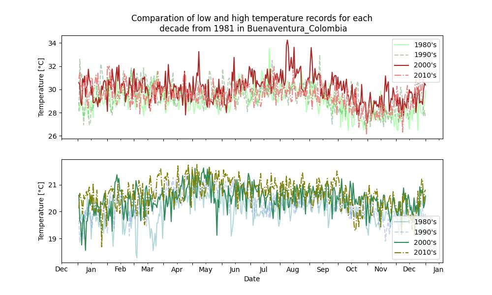

# Applied Plotting, Charting & Data Representation in Python

This repository contains the topics that were taught in the coursera course [Applied Plotting, Charting & Data Representation in Python](https://www.coursera.org/learn/python-plotting?specialization=data-science-python), 
it contains the assignments as well.  These topics and assignments are gathered into different directories, according to weekly aims. The datasets used in 
the course are located in the Datasets directory of every week. Then each weekly aim is:

## First Week: Principles of Information Visualization
> This module is an introduction to principles of information visualization, where as early as Alberto Cairo's work, i.e., principles of truthfulness, beauty, functionality and insightfulness, we could use tools for thinking about design and graphical heuristics for thinking about creating effective visualizations, and rise a judgement to discern missleading graphs.
> For instance, the following plot assures that college education just isn't worth the money anymore. But it does not. [INSIDER](https://www.businessinsider.com/these-two-charts-prove-a-college-education-just-isnt-worth-the-money-anymore-2012-6)
>
> 
> 
> Firstly graphic forms is displayed incorrectly, expenditures related to college education are not comparable to the bacherol degree earnings in the way Insider does, because these expenditures correspond to some few college years, instead the earnings correspond to a person's full work lifetime. Namely, a person has an average work life about 40-50 years, so their earnings would be around $450,000. Finally, substract the expensive college education 
($95,000), so the net earnings are $355,000. Thus we know that information is displayed wrong, and we cannot conclude education is not longer worth it.

## Second Week: Basic Charting
> This module is about delving into basic charting. The assignment for this week is to work with real world CSV weather data and manipulate the data to display the minimum and maximum temperature for a range of dates. The result was the following
>
> 
>
> This data was taken from the places showed by the map. Precisely, this data corresponds to Detroit Willow Run Ap. 
>
> 
>
> For more details about this assignment you can click on [The Assignment 2](https://github.com/jpradas1/Applied_Plotting-Charting_Data-Representation_Python/blob/master/Week_2/Assignment_2.ipynb).

## Third Week: Charting Fundamentals
> This module explore charting fundamentals. For that purpose, use has been made of the paper [Sample-Oriented Task-Driven Visualizations](https://www.microsoft.com/en-us/research/wp-content/uploads/2016/02/Ferreira_Fisher_Sample_Oriented_Tasks.pdf), where it's explored some statistical issues, e.g., a challenge that users face is that, for a given y-axis value, it is difficult to know which x-axis values are most likely to be representative, because the confidence levels overlap and their distributions are different (the lengths of the confidence interval bars are unequal). One of the solutions the authors propose for this problem is to allow users to indicate the y-axis value of interest (e.g. 42,000) and then draw a horizontal line and color bars based on this value. For example
>
> 
>
> So bars might be colored red if they are definitely above this value (given the confidence interval), blue if they are definitely below this value, or white if they contain this value.
>
> Then the purpose for this week's assignment is interactive with some randomly generated data and reply this graphs. There is going to be 4 degree of dificulty. (For more details about the source code to execute the following graphs, click on [The Assignment 3](https://github.com/jpradas1/Applied_Plotting-Charting_Data-Representation_Python/blob/master/Week_3/Assignment_3.ipynb))
> ### Easiest Option:
> Implement the bar coloring as described above - a color scale with only three colors, (e.g. blue, white, and red). Assume the user provides the y axis value of interest as a parameter or variable.
>
> 
>
> ### Harder & Even Harder Option:
> Implement the bar coloring as described in the paper, where the color of the bar is actually based on the amount of data covered (e.g. a gradient ranging from dark blue for the distribution being certainly below this y-axis, to white if the value is certainly contained, to dark red if the value is certainly not contained as the distribution is above the axis). Moreover, add interactivity to the above, which allows the user to click on the y axis to set the value of interest. The bar colors should change with respect to what value the user has selected.
> 
> 
>
> ### Hardest Option:
> Allow the user to interactively set a range of y values they are interested in, and recolor based on this (e.g. a y-axis band, see the paper for more details).
> 
> 
>
> On the other hand, there was onther optional assignment. This assignment consisted of performing a gif which shows how some histogram are filled by using 4 different distributions (uniform, normal, exponential and gamma distributions). [Optional Assignment](https://github.com/jpradas1/Applied_Plotting-Charting_Data-Representation_Python/blob/master/Week_3/Assignment_III.ipynb)
> 
> 
## Fourth Week: Applied Visualizations
> In this module, then everything starts to come together. The final assignment is entitled "Becoming a Data Scientist". This assignment requires to find at least two datasets on the web which are related, and that you visualize these datasets to answer a question with the broad topic of weather phenomena (see below) for the region of Bogotá, Bogota D.C., Colombia, or Colombia more broadly. So the question to answer is: How has the temperature changed over the last 4 decades (1981-2020) along Colombia? Graphics asnwering that are ([Assignment 4](https://github.com/jpradas1/Applied_Plotting-Charting_Data-Representation_Python/blob/master/Week_4/Assignment_4.ipynb))
> 
> 
> 
> 
>
> These visuals answer the question about how has the temperature changed over the last 4 decades along Colombia, use has been made of data from Bogota, Buenaventura and Cocuy, all cities from Colombia. Data goes from 1st January 1981 to 31st December 2019 and thanks to NASA's weather datasets this analysis was made. For a better analysis data related to 29th Febrary of each leap year was dismissed.
> 
> Each graph has two plot, top plot tells us about the highest temperature record for each day of the year over the 80's, 90's, 2000's and 2010's decades. As well as top plot, low plot has information on the lowest temperature record. We can notice that the temperatures of 2 last decades are higher than the 2 first ones, and we can see this behavior for each city. This could be product of Climate Change.
